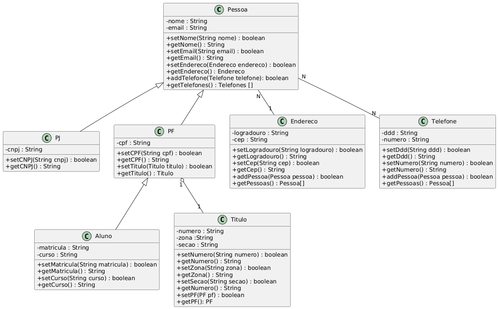

## Fundamentos de OO
### Orientação a Objetos – Relacionamentos entre Classes (1:1, 1:N e N:N)

Nos capítulos anteriores foram apresentados os principais conceitos da Programação Orientada a Objetos utilizando JavaScript, como a criação de classes, encapsulamento, herança e sobrescrita de métodos. Esses conceitos permitiram modelar objetos capazes de representar entidades do mundo real e proteger seus dados por meio de atributos privados e métodos públicos.

Entretanto, aplicações reais são compostas por diversas classes que precisam interagir entre si. Um sistema de cadastro, por exemplo, normalmente relaciona pessoas, endereços, telefones, documentos e diversos outros objetos que colaboram para representar uma mesma informação.

Nesta apostila serão estudados os principais tipos de relacionamentos entre classes utilizando JavaScript. Serão apresentados exemplos de relacionamentos 1:1 (um para um), 1:N (um para muitos) e N:N (muitos para muitos), demonstrando como estabelecer associações entre objetos, manter referências cruzadas e organizar aplicações orientadas a objetos de forma modular.

Ao longo da apostila serão utilizadas as classes `Pessoa`, `Endereco`, `Telefone`, `PF` e `Titulo`, permitindo observar como esses relacionamentos são implementados na prática e como diferentes objetos podem compartilhar informações de forma consistente.

#### Figura 1 – Diagrama UML das classes utilizadas nesta apostila.

Antes de iniciar a implementação, observe como as classes se relacionam entre si na Figura 1. Ao longo da leitura, cada um desses relacionamentos será implementado e explicado detalhadamente.

#### E-book:
https://js-oo-ebook.vercel.app/docs/Tutorial-OOBasic/OO-Relacionamentos